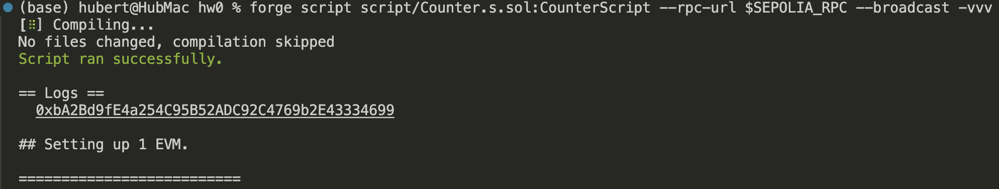
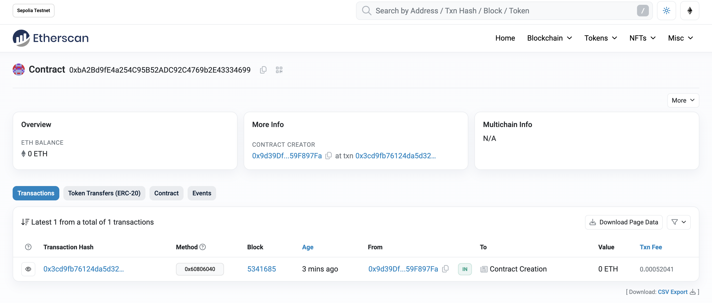

# 2024-Spring-HW0

All the detailed specified in Homework 0 documentation.

## Wallet Address
Please provide your MetaMask wallet address:
0x9d39Df98AA94e12D44f6cdFC5c65824459F897Fa
## Local Testing
Please provide a screenshot of the `forge test -vvv` command running in your local environment.

## Contract Address
Please provide the contract address that you deployed on the Sepolia network.

0xbA2Bd9fE4a254C95B52ADC92C4769b2E43334699

## Sepolia Etherscan
Paste the contract address into the Sepolia Etherscan and share the screenshot.
